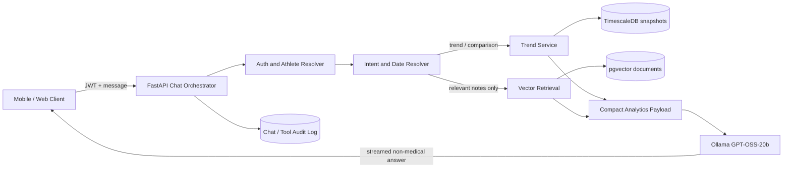

# RhythmX Athlete Intelligence Chat Architecture Plan

## 1. Goal

Enable an authenticated athlete to ask questions such as:

- "Compare my recovery over the last 7 days."
- "Has my readiness improved since last week?"
- "Why did my injury-risk score change?"
- "Compare readiness and recovery this month."

Answers must be factual, fast, non-medical, attributable to a particular snapshot version, and efficient on the EC2-hosted Ollama `gpt-oss:20b` model.

## 2. Design Decisions

| Concern | Decision |
| --- | --- |
| Numerical history and trends | TimescaleDB/Postgres queries and server-side calculations |
| Unstructured history | pgvector only for notes, prior summaries, and approved educational content |
| Athlete authorization | Resolve `athlete_id` from the JWT/session; never accept it from an LLM tool call |
| LLM responsibility | Interpret a compact trusted result; never calculate scores or generate SQL |
| Scoring record | Immutable, versioned daily snapshot |
| Chat context | Question, compact analytics result, small conversation summary, optional short vector context |
| Safety | Non-medical language, data-completeness disclosure, and auditable provenance |

## 3. Target Flow



The chat endpoint completes authentication, intent resolution, and data retrieval *before* beginning the Ollama stream. It does not start streaming and then attempt database retrieval.

## 4. Responsibilities

### Intelligence engines

The existing recovery, readiness, risk, and overall endpoints receive calculated inputs like those in `intelligence-engine-curl-samples.md`. They produce current-day narrative/cards. Persist final scores, confidence, factors, and engine version after every run.

### Chat orchestrator

Replace the direct `POST /chat/` pass-through in `main.py` with an orchestrator that:

1. Authenticates the request and resolves one authorized `athlete_id`.
2. Classifies the request: current-day, trend, period comparison, metric comparison, note/history, or general information.
3. Resolves relative dates using the athlete timezone.
4. Calls fixed, parameterized application services.
5. Creates a small factual context payload.
6. Calls `rhythmx-chat:latest` and streams the final response.
7. Audits the query reference and model output.

### Trend service

The trend service is trusted Python/server code, not an LLM. It validates an allow-list of score columns and calculates daily values, averages, low/high, first-to-last change, prior-period comparison, trend classification, and data completeness.

### Vector retrieval

Use pgvector only for relevant text: athlete journal notes, authorized coach notes, prior generated summaries, and approved general guidance. Filter every query by authorization, document type, and date. Never use vector similarity to calculate a score trend.

## 5. Snapshot Data Model

Store one canonical daily record per athlete and scoring-engine version. Keep frequently queried scores as typed columns; use JSONB for flexible factors/actions.

```sql
CREATE TABLE athlete_daily_snapshot (
  athlete_id uuid NOT NULL,
  snapshot_at timestamptz NOT NULL,
  local_date date NOT NULL,
  recovery_score smallint CHECK (recovery_score BETWEEN 0 AND 100),
  readiness_score smallint CHECK (readiness_score BETWEEN 0 AND 100),
  injury_risk_score smallint CHECK (injury_risk_score BETWEEN 0 AND 100),
  health_band_score smallint CHECK (health_band_score BETWEEN 0 AND 100),
  recovery_band text,
  readiness_zone text,
  risk_band text,
  risk_zone text,
  model_confidence numeric(4,3),
  confidence_level text,
  hrv_score smallint,
  sleep_score smallint,
  fatigue_score smallint,
  stress_score smallint,
  soreness_score smallint,
  risk_factors jsonb NOT NULL DEFAULT '[]',
  penalty_factors jsonb NOT NULL DEFAULT '[]',
  recommended_actions jsonb NOT NULL DEFAULT '[]',
  dominant_concern text,
  engine_version text NOT NULL,
  calculated_at timestamptz NOT NULL DEFAULT now(),
  PRIMARY KEY (athlete_id, local_date, engine_version)
);

SELECT create_hypertable(
  'athlete_daily_snapshot', by_range('snapshot_at'), if_not_exists => true
);

CREATE INDEX athlete_snapshot_date_idx
  ON athlete_daily_snapshot (athlete_id, local_date DESC);
```

Never overwrite historical scores when scoring logic changes. Write a new `engine_version` and choose the active version explicitly at query time.

## 6. Chat API and Intent Contract

The client sends a message and optional metadata:

```json
{
  "message": "Has my recovery improved over the last 7 days?",
  "conversation_id": "optional-uuid",
  "timezone": "America/Halifax"
}
```

The backend derives an internal intent:

```json
{
  "intent": "period_comparison",
  "metric": "recovery_score",
  "start_date": "2026-09-09",
  "end_date": "2026-09-15",
  "comparison": "previous_period"
}
```

Start with deterministic matching for known metric, comparison, and date phrases. Use a small structured-output LLM router only when a request is ambiguous. Neither route may supply arbitrary column names, SQL, or another athlete ID.

## 7. Trusted Analytics Payload

The LLM receives a compact result, never raw seven-day engine inputs or full snapshot documents.

```json
{
  "metric": "recovery_score",
  "label": "Recovery",
  "period": {"start": "2026-09-09", "end": "2026-09-15"},
  "daily_values": [
    {"date": "2026-09-09", "value": 68},
    {"date": "2026-09-10", "value": 72}
  ],
  "summary": {
    "average": 73.9,
    "minimum": 68,
    "maximum": 79,
    "start_value": 68,
    "end_value": 79,
    "absolute_change": 11,
    "trend": "improving"
  },
  "comparison": {"previous_period_average": 68.8, "average_change": 5.1},
  "data_quality": {"requested_days": 7, "available_days": 7, "confidence": "high"},
  "drivers": ["Sleep score improved", "Fatigue score decreased"],
  "snapshot_engine_version": "2026.09.1"
}
```

For injury risk, label direction explicitly because a decrease is generally favorable. If data is incomplete, state it in the payload and require the model to expose the limitation plainly.

## 8. Ollama Prompt and Token Budget

Use `gpt-oss:20b` as the answer synthesizer. Configure the chat model with a bounded context:

```dockerfile
PARAMETER num_ctx 8192
PARAMETER temperature 0.2
PARAMETER top_p 1.0
```

Target 1,500–3,500 total tokens per normal query:

| Input/output | Budget |
| --- | ---: |
| System and safety prompt | 500–800 |
| Athlete question | 20–100 |
| Compact analytics result | 300–800 |
| Conversation summary / recent turns | 200–600 |
| Optional vector context | Maximum 500 |
| Reasoning | 256–512 |
| Final answer | 150–300 |

For analytical questions, the server has calculated the facts. Use low reasoning effort and a `max_thinking_tokens` limit around 512. Keep final answers close to 300 tokens. Log Ollama's final `prompt_eval_count`, `eval_count`, and latency to tune these limits with production data.

## 9. Prompt Boundary

Pass the question and trusted analytics result as separate messages. Update the chat prompt:

```text
Use only ATHLETE_ANALYTICS_RESULT for dates, scores, trends, and comparisons.
Do not calculate missing values, invent history, or expose database/tool internals.
If data_quality shows missing data, clearly state the limitation.
For historical requests, use a short table or bullets and remain non-medical.
```

The model explains and summarizes; it does not override a returned trend, diagnose an injury, or present a risk signal as a medical conclusion.

## 10. Suggested Module Layout

```text
app/
  api/chat.py                 # authenticated streaming endpoint
  services/intent_parser.py   # message -> validated internal intent
  services/trend_service.py   # summaries, comparisons, data quality
  repositories/snapshots.py   # parameterized Timescale queries
  services/context_search.py  # pgvector, permission-filtered
  services/ollama_client.py   # streamed model call and metrics
  services/conversation.py    # short memory and audit persistence
```

This may initially remain in `main.py`, but preserve these boundaries as implementation grows.

## 11. Security, Privacy, and Audit

- Enforce Postgres row-level security or equivalent repository filters by authenticated `athlete_id`.
- Do not log raw health records to the JSONL runtime training dataset by default. The current `main.py` logging flow needs a privacy review before production use.
- Store an audit record with request ID, athlete ID, intent, date range, snapshot engine version, result hash, model name, token counts, latency, and response ID.
- Apply retention, deletion, encryption, consent, and regional requirements appropriate to health-adjacent data.
- Return the established non-medical disclaimer and escalate severe symptom text per the chat safety prompt.

## 12. Delivery Phases

### Phase 1 — Reliable 7-day score trends

1. Create the snapshot hypertable and daily ingestion/upsert workflow.
2. Implement `get_score_trend` in trusted Python with fixed SQL.
3. Add authenticated `POST /chat` orchestration for recovery, readiness, risk, and health band.
4. Send compact results to the existing chat model.
5. Add tests for date resolution, authorization, empty data, and missing days.

### Phase 2 — Comparisons and conversation

1. Add equal-length prior-period comparison.
2. Add readiness-versus-recovery comparison.
3. Persist compact conversation summaries and tool audit records.
4. Add response streaming metrics and a token/latency dashboard.

### Phase 3 — pgvector context

1. Ingest approved notes and summaries with tenant/athlete metadata.
2. Add permission-filtered retrieval capped at a few short chunks.
3. Evaluate whether retrieval improves answers; disable it for purely numerical questions.

## 13. First-Release Definition of Done

An athlete can ask, "Compare my recovery for the last 7 days." The system authorizes the athlete, reads only active-version snapshots, calculates the trend in Postgres/Python, sends fewer than 1,000 analytics-context tokens to Ollama, streams a concise non-medical response, records provenance, and reports insufficient data when the requested period is incomplete.
